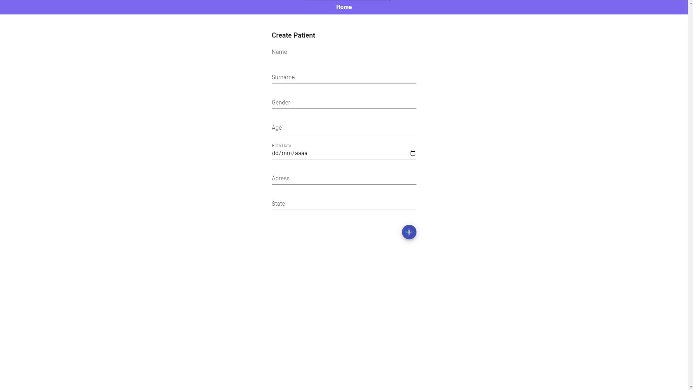
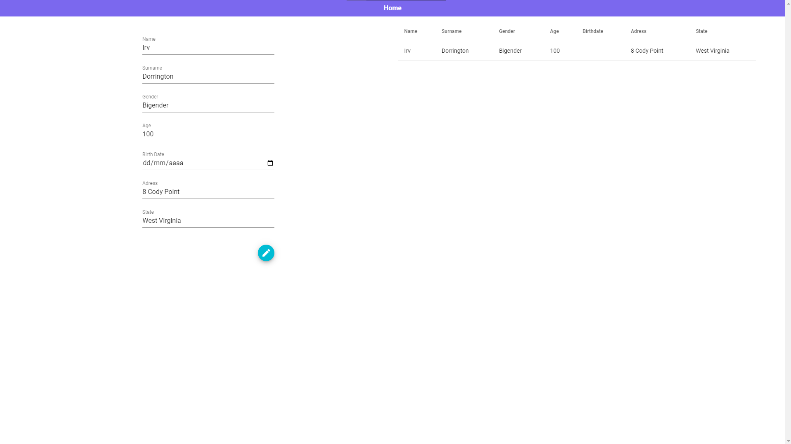

# Desafio-MV

Desafio para vaga de desenvolvedor front-end Jr na empresa COMEIA.

# Recursos

* O aplicativo foi desenvolvido com Vue.js, VueX, Vue.router, Vuetify, JavaScript, CSS, HTML, Axios, animate.css, SASS, API.

# Uso

1. Clone o repositório do GitHub.
2. Abra o projeto no seu editor de código.
3. Instale o pacote do projeto com npm install.
3. Starte o projeto com npm run serve.

# Créditos

Este projeto foi criado por Alaska Websites.